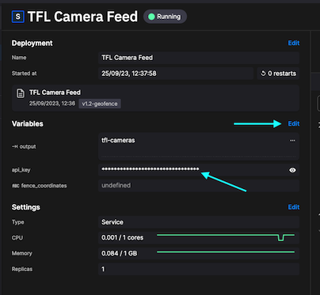

# Real-time image processing

Real-time image processing pipeline template project.

The pipeline uses the Transport for London (TfL) traffic cameras, known as Jam Cams, as the video input. The [YOLO v8](https://docs.ultralytics.com/) machine learning model is used to identify various objects such as types of vehicles. Additional services count the vehicles and finally the data is displayed on a map which is part of the web UI that has been creatde specially for this project. 

## Technologies used

Some of the technologies used by this template project are listed here.

**Infrastructure:** 

* [Quix](https://quix.io/)
* [Docker](https://www.docker.com/)
* [Kubernetes](https://kubernetes.io/)

**Backend:** 

* [Apache Kafka](https://kafka.apache.org/)
* [Quix Streams](https://github.com/quixio/quix-streams)
* [Flask](https://flask.palletsprojects.com/en/2.3.x/#)
* [pandas](https://pandas.pydata.org/docs/reference/api/pandas.DataFrame.html)

**Video capture:**

* [TfL API](https://api-portal.tfl.gov.uk)
* [OpenCV](https://opencv.org/)

**Object detection:**

* [YOLOv8](https://github.com/ultralytics/ultralytics)

**Frontend:** 

* [Angular](https://angular.io/)
* [Typescript](https://www.typescriptlang.org/)
* [Microsoft SignalR](https://learn.microsoft.com/en-us/aspnet/signalr/)
* [Google Maps](https://developers.google.com/maps)

## Live demo

You can see the project running live on [Quix](https://app-demo-computervisiondemo-prod.deployments.quix.ai/).

## Getting help

If you need any assistance while following the tutorial, we're here to help in the [Quix forum](https://forum.quix.io/).

## Prerequisites

To get started make sure you have a [free Quix account](https://portal.platform.quix.ai/self-sign-up).

If you are new to Quix it is worth reviewing the [recent changes page](https://quix.io/docs/platform/changes.html), as that contains very useful information about the significant recent changes, and also has a number of useful videos you can watch to gain familiarity with Quix.

### TfL account and API key

You'll also need a [free TfL account](https://api-portal.tfl.gov.uk). 

Follow these steps to locate your TfL API key:

  1. Register for a [free TfL account](https://api-portal.tfl.gov.uk).

  2. Login and click the `Products` menu item.

  3. You should have one product to choose from: `500 Requests per min.`

  4. Click `500 Requests per min.`

  5. Enter a name for your subscription into the box, for example "QuixFeed", and click `Register`.

  6. You can now find your API Keys in the profile page.

Later, you'll need to configure the TfL service with your own TfL API key. To do this, open the service and edit the environment variable as shown here:



### Google Maps API key

When testing the project you might find Google Maps does not load correctly for you - this is because the code has the Quix Google Maps API key. To work around this, you can set the Google Maps API key to an empty string, and then enable "developer mode" in your browser - the maps then display correctly. 

To set the Google Maps API key to an empty string, you need to edit `app.module.ts` and modify the `apiKey` field in `AgmCoreModule.forRoot` to the following:

``` typescript
AgmCoreModule.forRoot({
      apiKey: ''
    }),
```

### Git provider

You also need to have a Git account. This could be GitHub, Bitbucket, GitLab, or any other Git provider you are familar with, and that supports SSH keys. The simplest option is to create a free [GitHub account](https://github.com).

While this tutorial uses an external Git account, Quix can also provide a Quix-hosted Git solution using Gitea for your own projects. You can watch a video on [how to create a project using Quix-hosted Git](https://www.loom.com/share/b4488be244834333aec56e1a35faf4db?sid=a9aa124a-a2b0-45f1-a756-11b4395d0efc).

If you want to use the Quix AWS S3 service (optional), you'll need to provide your credentials for accessing AWS S3.

## The pipeline

The following screenshots show the pipeline you build in this tutorial.

The first part of the pipeline is:


The second part of the pipeline is:


There are several *main* stages in the pipeline:

1. *TfL camera feed* - TfL Camera feed or "Jam Cams". This service retrieves the raw data from the TfL API endpoint. A list of all JamCams is retrieved, along with the camera data. The camera data contains a link to a video clip from the camera. These video clips are hosted by TfL in MP4 format on AWS S3. A stream is created for each camera, and the camera data published to this stream. Using multiple streams in this way enables a solution capable of horizontal scaling, through additional topic partitions and, optionally, replicated services in a consumer group. Once the camera list has been scanned, the service sleeps for two minutes, and then repeats the previous code. This reduces the load, and also means the API limit of 500 requests per minute is not exceeded. Messages are passed to the frame grabber.

2. *TfL traffic camera frame grabber* - this service grabs frames from a TfL video file (MP4 format) at the rate specified. By default the grabber extracts one frame every 100 frames, which is typically one per five seconds of video. Messages are passed to the object detection service.

3. *Object detection* - this service uses the YOLOv8 computer vision algorthm to detect objects within a given frame.

4. *Stream merge* - merges the separate data streams (one for each camera) back into one, prior to sending to the UI.

5. *Web UI* - a UI that displays: frames with the objects that have been identified, and a map with a count of objects at each camera's location. The web UI is a web client app that uses the [Quix Streaming Reader API](https://quix.io/docs/apis/streaming-reader-api/intro.html), to read data from a Quix topic.

There are also some additional services in the pipeline:

1. *Cam vehicles* - calculates the total vehicles, where vehicle is defined as one of: car, 'bus', 'truck', 'motorbike'. This number is published to its utput topic. The *Max vehicle window* service subscribes to this topic.

2. *Max vehicle window* - calculates the total vehicles over a time window of one day. This service publishes messages its output topic.

3. *Data buffer* - this provides a one second data buffer. This helps reduce load on the Data API service.

4. *Data API* - this REST API service provide two endpoints: one returns the *Max vehicle window* values for the specified camera, and the other endpoint returns camera data for the specified camera. This API is called by the UI to obtain useful data.

5. *S3* - stores objects in Amazon Web Services (AWS) S3. This service enables you to persist any data or results you might like to keep more permanently.

More details are provided on all these services in the [tutorial](https://quix.io/docs/platform/tutorials/image-processing/index.html).

## Tutorial

Work through the [tutorial](https://quix.io/docs/platform/tutorials/image-processing/index.html).
